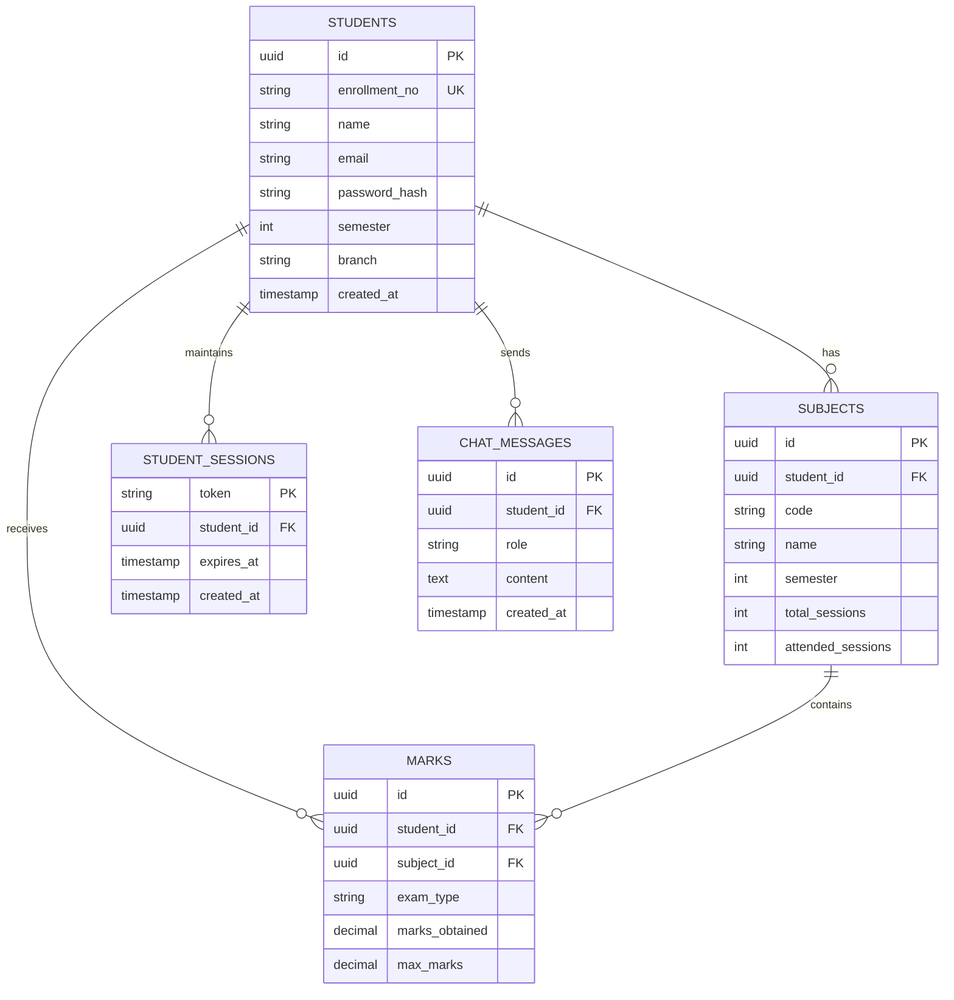

# EduMate AI 🎓

> AI-powered educational chatbot with student information system integration

[](https://www.typescriptlang.org/)
[](https://react.dev/)
[](https://tanstack.com/start)
[](https://supabase.com/)
[](https://deepmind.google/technologies/gemini/)

## 📋 Table of Contents

- [Overview](#overview)
- [Architecture](#architecture)
- [Tech Stack](#tech-stack)
- [Database Schema](#database-schema)
- [Project Structure](#project-structure)
- [Getting Started](#getting-started)
- [Environment Variables](#environment-variables)
- [API Reference](#api-reference)
- [Features](#features)
- [Deployment](#deployment)
- [Roadmap](#roadmap)

---

## 🎯 Overview

EduMate AI is a full-stack educational assistant that helps students track their academic progress, attendance, and grades through an intelligent chat interface. The system integrates with Student Information Systems (SIS) to provide personalized, context-aware responses.

### Key Capabilities

- 🔐 **Secure Authentication**: Enrollment-based login with session management
- 🤖 **AI Chatbot**: Real-time streaming responses powered by Gemini 2.5 Flash
- 📊 **Academic Analytics**: Attendance tracking, marks analysis, grade predictions
- 🎯 **Smart Recommendations**: Attendance recovery calculations (e.g., sessions needed to reach 75%)
- 💾 **Persistent Chat**: Message history stored per student

---

## 🏗️ Architecture

```
┌─────────────────┐     ┌──────────────────┐     ┌─────────────────┐
│   React Client  │────▶│  TanStack Start  │────▶│   Supabase      │
│   (Frontend)    │◄────│   (SSR/Edge)     │◄────│   (Backend)     │
└─────────────────┘     └──────────────────┘     └─────────────────┘
         │                       │                        │
         │                       ▼                        │
         │              ┌──────────────────┐            │
         │              │  Edge Functions  │            │
         │              │  - auth-login    │            │
         └─────────────▶│  - student-data  │◄───────────┘
                        │  - chat          │
                        └──────────────────┘
                                 │
                                 ▼
                        ┌──────────────────┐
                        │  Gemini AI API   │
                        │  (Lovable GW)    │
                        └──────────────────┘
```

### Data Flow

1. **Auth Flow**: Student authenticates via enrollment/password → SHA-256 hashed validation → Session token generated
2. **Chat Flow**: User message → Context enrichment (subjects/marks/attendance) → Gemini prompt → Streaming response → DB persistence
3. **Context Injection**: Student academic data is injected into system prompts for personalized responses

---

## 🛠️ Tech Stack

| Layer | Technology | Purpose |
|-------|-----------|---------|
| **Framework** | TanStack Start v1 | Full-stack React with SSR |
| **Runtime** | Vite 7 + Edge Workers | Build & serverless runtime |
| **Styling** | Tailwind CSS v4 | Utility-first styling |
| **UI Components** | shadcn/ui | Accessible component primitives |
| **Database** | Supabase (PostgreSQL) | Data persistence |
| **Auth** | Custom session-based | Enrollment/password auth |
| **AI** | Gemini 2.5 Flash | LLM inference |
| **Animations** | Framer Motion | UI transitions |
| **Icons** | Lucide React | Iconography |

---

## 🗄️ Database Schema

### Entity Relationship Diagram



### Key Indexes

- `idx_students_enrollment` on `students(enrollment_no)`
- `idx_subjects_student` on `subjects(student_id)`
- `idx_marks_student` on `marks(student_id)`
- `idx_chat_student` on `chat_messages(student_id, created_at DESC)`

---

## 📁 Project Structure

```
├── src/
│   ├── components/ui/        # shadcn/ui primitives
│   │   ├── button.tsx
│   │   ├── card.tsx
│   │   ├── input.tsx
│   │   └── ...
│   ├── hooks/                # Custom React hooks
│   │   └── use-mobile.tsx
│   ├── integrations/
│   │   └── supabase/
│   │       ├── auth-middleware.ts
│   │       ├── client.server.ts
│   │       ├── client.ts
│   │       └── types.ts      # Generated DB types
│   ├── lib/
│   │   ├── api.ts            # API client + session management
│   │   └── utils.ts          # Utility functions
│   ├── routes/               # TanStack file-based routing
│   │   ├── __root.tsx        # Root layout
│   │   ├── index.tsx         # Login page
│   │   ├── chat.tsx          # Main chat interface
│   │   ├── privacy-policy.tsx
│   │   └── terms-of-service.tsx
│   ├── router.tsx            # Router configuration
│   ├── routeTree.gen.ts      # Auto-generated
│   └── styles.css            # Tailwind + theme tokens
├── supabase/
│   ├── config.toml           # Supabase configuration
│   ├── functions/            # Edge Functions
│   │   ├── auth-login/       # Enrollment-based auth
│   │   ├── student-data/     # Student context fetch
│   │   └── chat/             # AI chat with streaming
│   └── migrations/           # SQL migrations
├── .env                      # Environment variables
├── package.json
├── vite.config.ts
└── wrangler.jsonc            # Edge runtime config
```

---

## 🚀 Getting Started

### Prerequisites

- Node.js 18+ or Bun 1.0+
- Supabase CLI (optional, for local dev)
- Git

### Installation

```bash
# Clone repository
git clone <repo-url>
cd edumate-ai

# Install dependencies
bun install

# Configure environment variables
cp .env.example .env
# Edit .env with your Supabase credentials

# Run development server
bun dev
```

### Database Setup

```bash
# Deploy migrations to Supabase
supabase db push

# Seed demo data (optional)
supabase db reset --seed-data
```

---

## 🔐 Environment Variables

| Variable | Description | Required |
|----------|-------------|----------|
| `VITE_SUPABASE_URL` | Supabase project URL | ✅ |
| `VITE_SUPABASE_PUBLISHABLE_KEY` | Anon/public API key | ✅ |
| `VITE_SUPABASE_PROJECT_ID` | Project reference ID | ✅ |
| `SUPABASE_SERVICE_ROLE_KEY` | Service key (edge functions) | ✅ |

### Edge Function Secrets

Set via Supabase Dashboard → Functions → Secrets:

| Secret | Description |
|--------|-------------|
| `LOVABLE_AI_GATEWAY_TOKEN` | AI Gateway access token |

---

## 📡 API Reference

### Authentication

#### POST `/functions/v1/auth-login`

Authenticate student with enrollment number and password.

**Request:**
```json
{
  "enrollment_no": "STU001",
  "password": "student123"
}
```

**Response:**
```json
{
  "token": "sess_abc123...",
  "student": {
    "id": "uuid",
    "enrollment_no": "STU001",
    "name": "John Doe",
    "semester": 4,
    "branch": "Computer Science"
  }
}
```

### Student Data

#### GET `/functions/v1/student-data`

Fetch complete academic context (requires `x-session-token` header).

**Response:**
```json
{
  "student": { ... },
  "subjects": [
    {
      "code": "CS101",
      "name": "Data Structures",
      "attended_sessions": 18,
      "total_sessions": 25
    }
  ],
  "marks": [
    {
      "exam_type": "midterm",
      "marks_obtained": 85,
      "max_marks": 100
    }
  ]
}
```

### Chat

#### POST `/functions/v1/chat`

Streaming AI chat endpoint.

**Request:**
```json
{
  "messages": [
    { "role": "user", "content": "What's my attendance?" }
  ]
}
```

**Response:** (SSE stream)
```
data: {"delta": {"content": "Your attendance..."}}
data: {"delta": {"content": " is 72%"}}
data: [DONE]
```

---

## ✨ Features

### 1. Smart Attendance Calculator

The AI calculates:
- Current attendance percentage per subject
- Sessions needed to reach 75% threshold
- Percentage gain/loss per session attended/missed

**Example Prompt Context:**
```
Student: John Doe (Sem 4, CSE)
Subject: CS101 - Data Structures
Attendance: 18/25 sessions (72%)
Status: Below 75% threshold

Calculation:
- Sessions needed for 75%: ceil(0.75 × 25) - 18 = 1 more session
- Percentage per session: 100/25 = 4%
```

### 2. Session Management

- Tokens stored in `localStorage`
- Automatic expiration handling
- Secure hash comparison (SHA-256 + salt)

### 3. Streaming Responses

- Server-Sent Events (SSE) for real-time typing effect
- Message persistence to `chat_messages` table
- Optimistic UI updates

---

## 🚢 Deployment

### Production Build

```bash
bun run build
```

### Edge Functions Deploy

```bash
supabase functions deploy auth-login
supabase functions deploy student-data
supabase functions deploy chat
```

### Environment Setup

1. Configure production Supabase project
2. Set edge function secrets
3. Deploy database migrations
4. Configure custom domain (optional)

---

## 🔮 Roadmap

- [ ] Admin dashboard for student management
- [ ] CSV bulk import from external SIS
- [ ] Chat history sidebar with conversation threads
- [ ] Push notifications for low attendance alerts
- [ ] Mobile app (React Native)
- [ ] Multi-language support
- [ ] Grade prediction ML model

---

## 📝 License

MIT License - see [LICENSE](./LICENSE.md) for details.

---

## 🤝 Contributing

1. Fork the repository
2. Create feature branch (`git checkout -b feature/amazing-feature`)
3. Commit changes (`git commit -m 'Add amazing feature'`)
4. Push to branch (`git push origin feature/amazing-feature`)
5. Open a Pull Request

---
